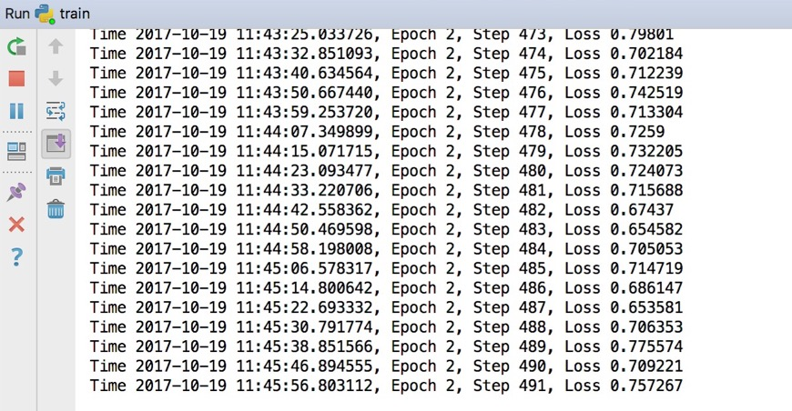

## 深度学习实现AI写代码
*利用LSTM长短期记忆的RNN网络来自动生成python代码*

#### 模型训练

* 修改`config.py`文件

  ```python
  # train path
  TRAIN_PATH = [
      # '/Users/zijiao/tensorflow',
      # 此处添加待训练的代码路径
  ]
  ```

* 运行`train.py`开始训练，输出如下：

  


#### 模型使用

训练完模型之后，直接运行`coding.py`即可开始自动生成代码，如下：

```python
Load last model params successfully.
Start predict...
    def test_URLTddresviound(shouldConffts(saventer):
        cada = Resition('Helidenent')
        self.assertEqual(n_moded.add(self.username, reactor)
            return None
        c.name = self.mktype("somethod')
            bNd[0], B_MESSD = IBool(1,4)
        self.container.remactorAuttom_optswith(14, makeR), (True)
        cmptraties in type()
        cleed = port
        return ClientLogChecker().statil_netxrForm(self.assertFalseCicneLogoint, self, *args)
```

